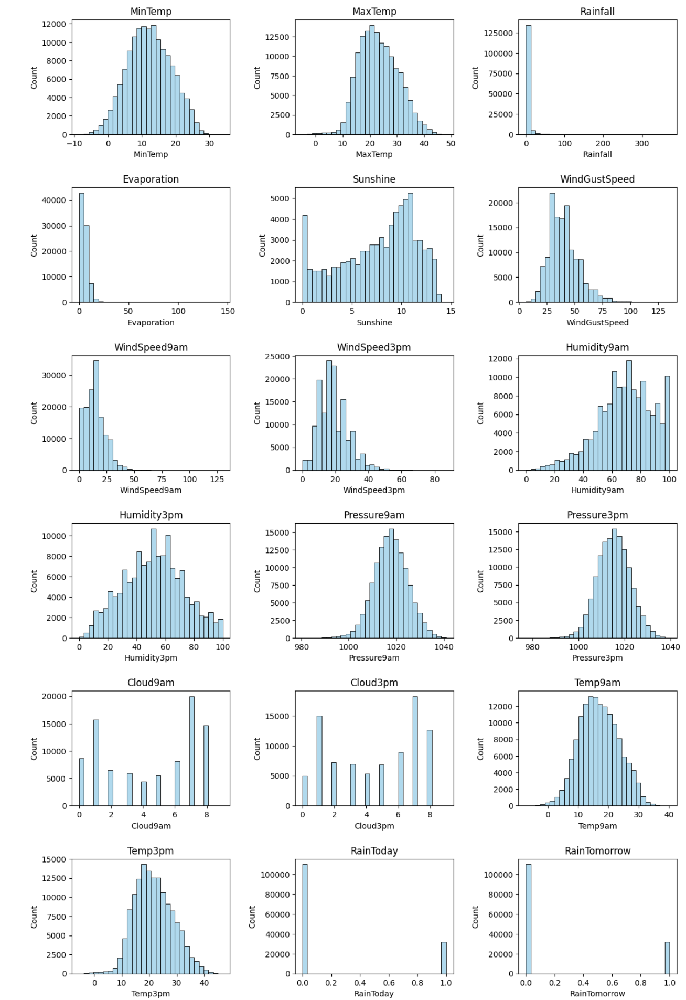
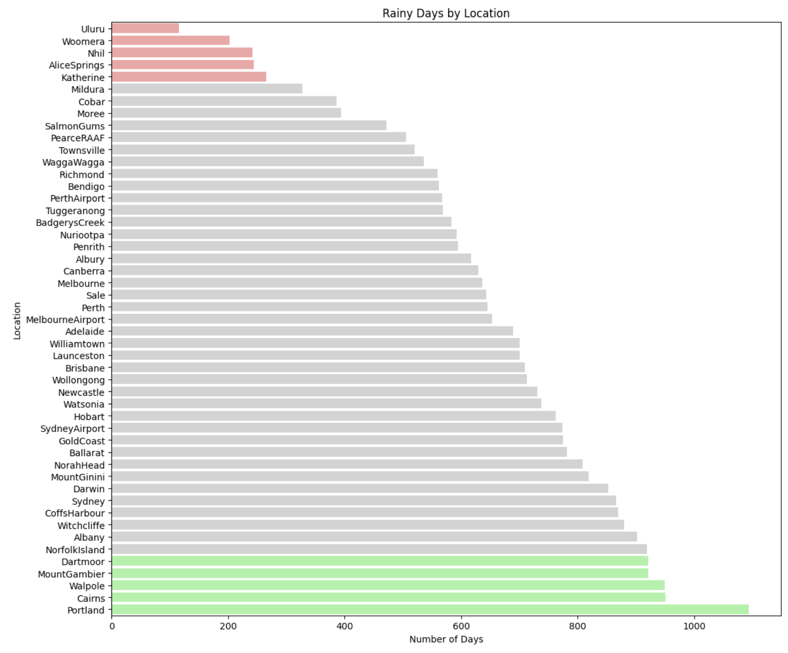
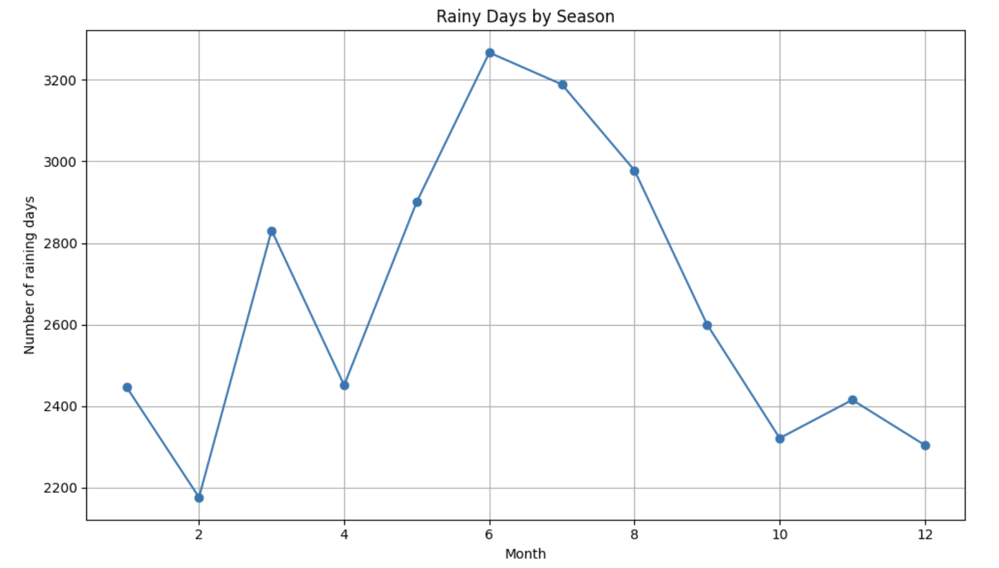
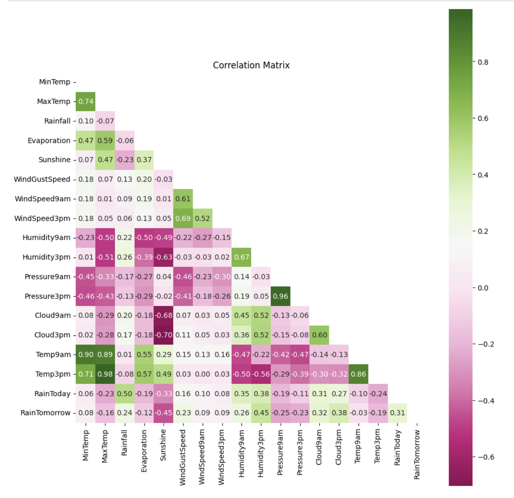
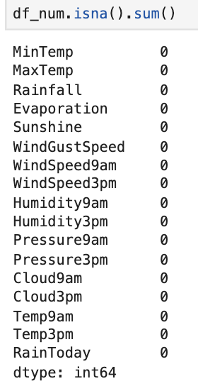
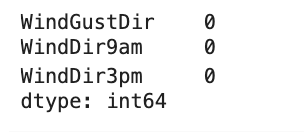
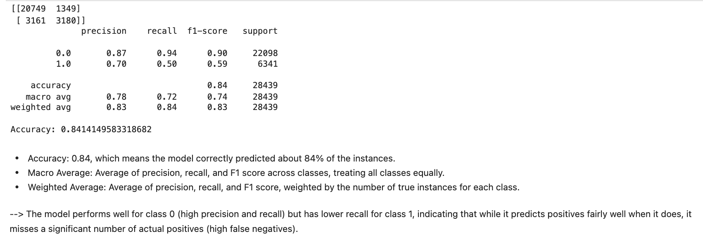
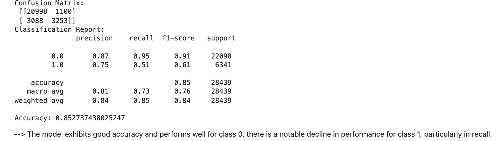
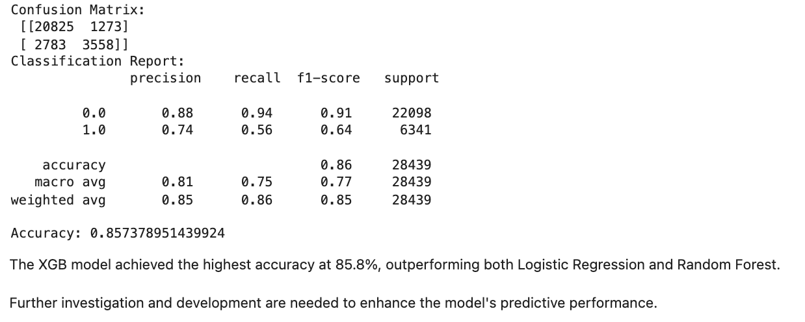
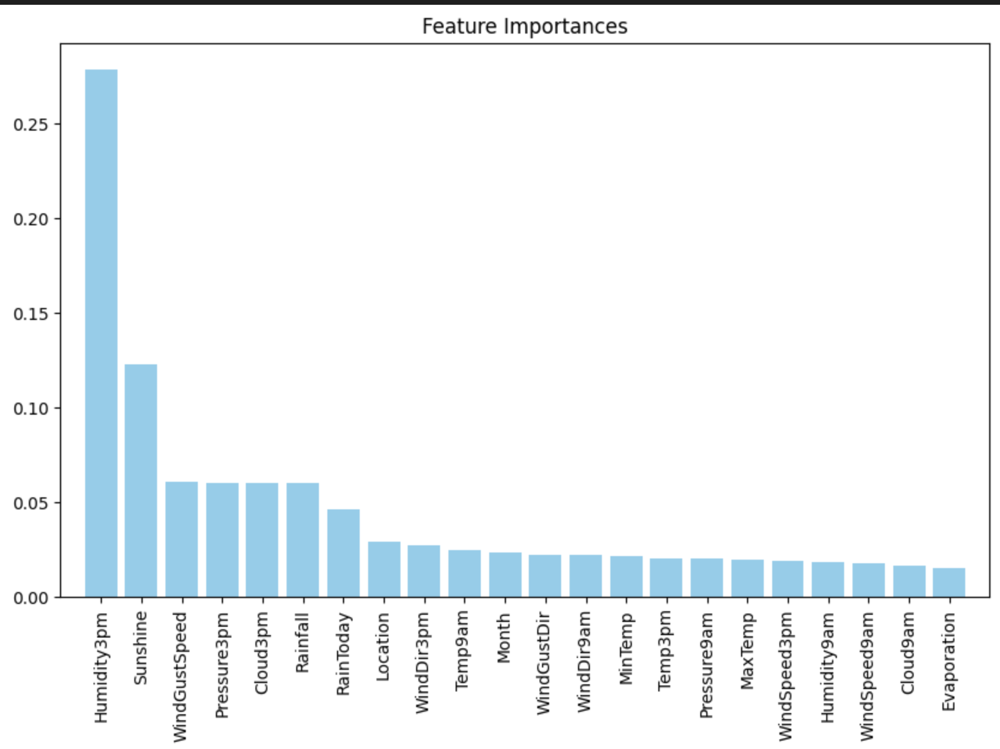

# Weather Prediction - Rain in Australia 


## Project Overview
### Data Source
The data used in this project was downloaded from Kaggle.

- Link dataset: [Australian weather dataset](https://www.kaggle.com/jsphyg/weather-dataset-rattle-package)

### Business Problem

Accurate weather forecasts are vital for helping citizens plan their daily activities, such as deciding whether to carry an umbrella. This project aims to analyze historical weather data in Australia to develop a predictive model for forecasting rain the next day. The model will also provide an error index to indicate its reliability, enabling users to make informed decisions based on the forecast.

### Table of Contents
1. Exploratory Data Analysis (EDA)
- Histograms
- Rainy Days by Location
- Seasonality Analysis
- Correlation Matrix

2. Data Preprocessing
- Handling Missing Values
    - Continuous Features: ImperativeImputer
    - Categorical Features: Probabilistic Imputation
-->Concatenating the Final DataFrame

3. Modeling
- Logistic Regression
- Random Forest
- XG Boost

4. Conclusion
## 1. Exploratory Data Analysis (EDA)
#### Histograms


#### Rainy Days by Location


#### Seasonality


#### Correlation Matrix

## 2. Data Preprocessing
### Missing Values
Remove rows that missing values on `RainTomorrow` features.
```py
df_imp = df_numeric.dropna(axis = 0 , subset = ['RainTomorrow'])
```
- For numeric values: Using __IterativeImputer__ to handle missing numeric values is more sophisticated than relying on mean or median methods, as it considers the relationships between features. This approach leads to better imputation results. 

```py
cont_feats = [col for col in df_imp.columns]
cont_feats.remove('RainTomorrow')
cont_feats
imp = IterativeImputer(random_state=42)
df_impcon = imp.fit_transform(df_imp[cont_feats])
```


- For categories features, using __probabilistic imputation__ for better data quality and potentially improved model performance compared to simpler imputation techniques.
``` py
for col in df_imputed_cat.columns:
    values = df_imputed_cat[col].value_counts().index  # Access first column by index
    probs = df_imputed_cat[col].value_counts(normalize=True).values
    df_imputed[col] = df_imputed_cat[col].replace(np.nan, np.random.choice(a=values, p=probs))
```

- Concatenate all the features into a final dataframe
```py
df_final = pd.concat(objs=[ df_num.reset_index(drop=True),df_cat1.reset_index(drop=True), df1[['Month','RainTomorrow']].reset_index(drop=True)], axis=1)
```
## 3. Modeling

Three types of models were explored, and the best model was selected by comparing the confusion matrices of all three.
1. Logistic Regression

2. Random Forest


3. XGBoost


Display the most important features.


## 4. Conclusion
From the result, it showes that the XGB model achieved the highest accuracy at 85.8%, outperforming both Logistic Regression and Random Forest.