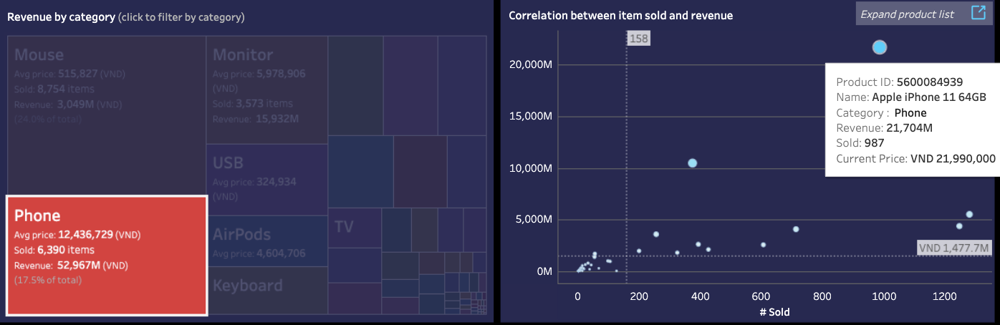
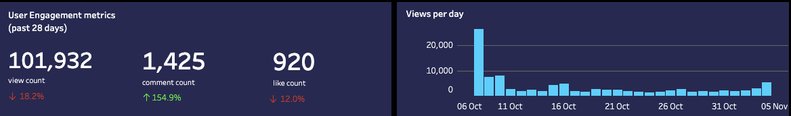
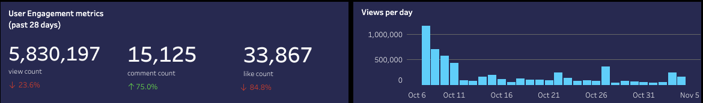
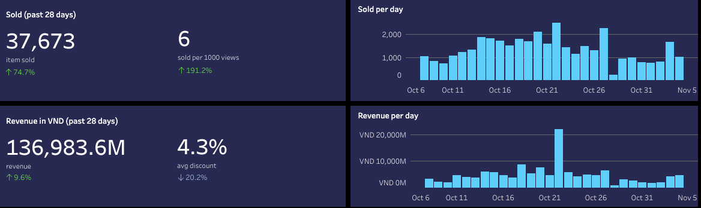
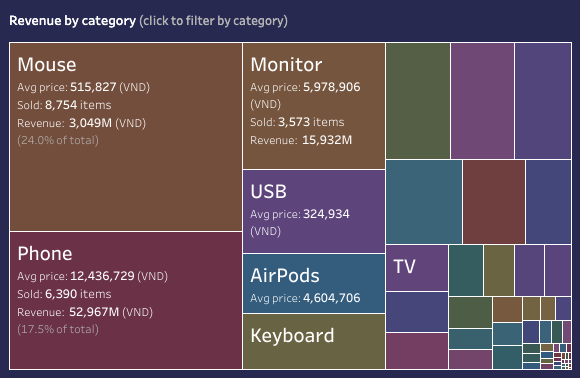
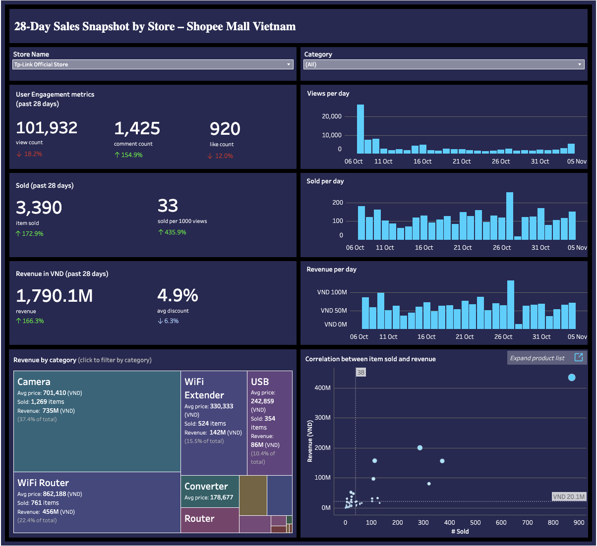
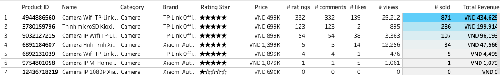
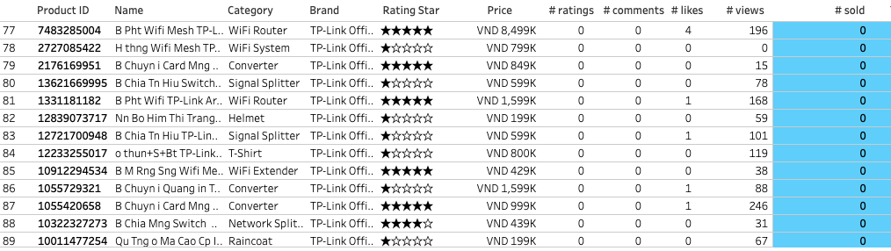
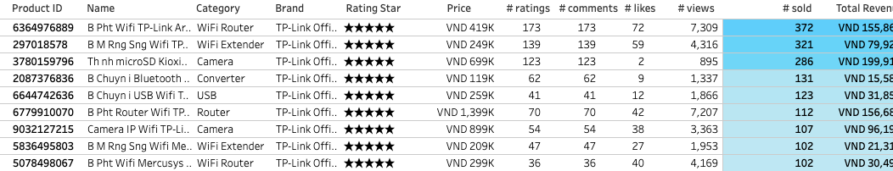

# Shopee Mall Vietnam: 28-Day Sales Overview by Store

> **Tools:** Jupyter Notebook, Python, Tableau  
> **Techniques:** Data re-processing, Analysis, Visualizaton  
> **Source code:** [`Data reprocessing - Python code`](data_reprocessing_category.ipynb)  
> **Dashboard:** [Tableau Public](https://public.tableau.com/app/profile/tien.le2550/viz/ShopeeMallDashboardotherversion/Dashboard1)

---
## 📚 Table of Contents
- [Overview](#overview)
    - [Key features](#key-features)
    - [Target Audiences](#target-audiences)
- [Data source](#data-source)
- [Data reprocessing](#data-reprocessing)
- [Key insights](#key-insights)
    - [Market Analysis](#market-analysis)
        - [User engagement metrics](#user-engagement-metrics)
        - [Sales trend](#sales-trend)
        - [Best selling](#best-selling)
    - [Store Analysis Example: TP-Link Official Store](#store-analysis-example-tp-link-official-store)
        - [Sales Surge on October 27](#sales-surge-on-october-27)
        - [Top-Performing Category: Home Security Cameras](#top-performing-category-home-security-cameras)
        - [Underperforming Products: No Sales, No Views](#underperforming-products-no-sales-no-views)
        - [Strategic Opportunities in Networking](#strategic-opportunities-in-networking)
- [Recommendations](#recommendations)
    - [Aspiring Shopee Sellers](#aspiring-shopee-sellers)
    - [Existing E-commerce Businesses](#existing-e-commerce-businesses)
    - [Researchers and Market Analysts](#researchers-and-market-analysts)
    - [Platform Operators Shopee Mall](#platform-operators-shopee-mall)
- [Final Note](#final-note)

---
## Overview
  
Build a dynamic and insightful dashboard to visualize the **sales performance of computer-related stores** on **Shopee Mall Vietnam** over the past **28 days**. The dashboard enables users to explore both **store-level** and **category-level** sales trends across a curated selection of **15 electronics and computer stores**.

---

### Key Features

📊 **Sales Performance Tracking**

* Visualize daily trends in **views**, **customer interactions**, **items sold**, and **revenue** for each store.
* Compare performance over the **last 28 days vs. the previous 28 days** to evaluate growth or decline.

📈 **Trend Visualization**

* Identify seasonal patterns, spikes, and dips in performance using **bar charts** and **interactive graphs**.
* Filter data by store or category to customize the view.
📂 **Category Insights & Product Analysis**

* Analyze **aggregated sales by product category** (e.g., laptops, accessories, components) across all 15 stores.
* Highlight **best-selling products** and **slow-moving items** using ranked tables and key metrics (e.g., total units sold, revenue).
* Gain actionable product-level insights with detailed tables and performance indicators.

💼 **Market Research Tool**

* Support **entrepreneurs** and **business analysts** in identifying **high-potential product segments** or store models.
* Compare store strategies, category strengths, and sales performance to evaluate **market opportunities**.

---

### Target Audiences

* **Aspiring Shopee sellers** seeking data-driven insights before entering the market
* **Existing e-commerce businesses** considering product or category diversification
* **Researchers and analysts** studying e-commerce trends in Vietnam’s tech retail sector

---

## Data source

This dashboard is based on **real-world data** collected from the **Shopee Mall Vietnam** platform. The dataset was cleaned and reprocessed to ensure it's ready for reliable analysis.

Please not this data was collected for educational purposes only.

### **Data Collection Period**

* **Start Date:** August 26, 2021
* **End Date:** November 4, 2021
* **Total Records:** 36,970 product-level entries

The analysis focuses on the **most recent 28-day period** before November 4, 2021:

* **Current Period:** October 8, 2021 – November 4, 2021
* **Comparison Period:** September 10, 2021 – October 7, 2021

This allows for a meaningful comparison of sales trends over two consecutive 28-day periods.

📁 **Key Data Fields Used in the Dashboard**

The following columns are used for visualizations and performance insights:

* **Product Information**:

  * `product_id`, `product_name`, `product_type`, `product_category_id`, `category_id`, `category_name`

* **Sales & Engagement Metrics**:

  * `product_price`, `current_product_price`, `new_items_sold`, `new_like_count`, `new_view_count`, `new_comment_count`

* **Ratings & Reviews**:

  * `product_avg_rating`, `product_current_avg_rating`, `new_rating_count`, `total_rating_count`, `rating_count_details`

* **Other Attributes**:

  * `product_current_status`, `currency`, `product_current_stock`, `statistic_date`

## Data reprocessing

Create a `product category column` for market category insights by manually defining and translating category names using Python in a Jupyter Notebook, utilizing the `pandas` package.  

**Source code:** [`Data reprocessing - Python code`](data_reprocessing_category.ipynb)  

## Key insights

### Market Analysis

#### User engagement metrics

`Views` decreased by 23.6%, there was a noticeable spike in views on October 8th, suggesting a specific event, promotion, or external factor temporarily boosted interest at the start of the period. After that peak, views fluctuated but didn’t maintain that high level, indicating unstable or waning engagement over the rest of the 28 days. 

`Likes` dropped by 84.8%, which could be a result of decreased views or product-related issues. However, `comment` count surged by 75%, potentially reflecting either positive or negative buyer feedback after purchase. If overall ratings remain high, this may be a positive sign; otherwise, it could signal problems. 

This shift suggests changing engagement patterns rather than a straightforward decline. Further analysis is needed to better understand these dynamics and their root causes.

#### Sales trend  
Despite the decline in user interactions, sales increased over the past 28 days—quantity sold rose by 74.7% (191,2% every 1000 views) and revenue increased by 9.6%. Sales peaked on October 22 and hit their lowest point on October 28. Interestingly, while revenue peaked on October 22, the quantity sold only increased slightly, suggesting that the spike was likely driven by high-value purchases or brand-specific deals rather than a market-wide promotion.

#### Best selling

Over the past 28 days, **mice** were the top-selling category by unit volume, led by the Wireless Logitech Mouse. Although the Apple Magic Mouse had a lower sales volume, it generated the highest revenue within the category due to its premium pricing. These trends highlight a clear market divide between high-volume, affordable products and lower-volume, high-revenue premium devices.

Overall, **phones** generated the highest revenue, driven primarily by the Apple iPhone 11 64GB, followed by the iPhone 12 Pro Max 128GB. This suggests Apple’s continued dominance in the smartphone market and indicates that new product releases or brand loyalty significantly influence consumer spending.

### Store Analysis Example: TP-Link Official Store

  

TP-Link's **user engagement mirrored the overall market trend** — both **views and likes declined**, while **comments increased significantly**, suggesting customers are either sharing more feedback post-purchase or raising concerns that need addressing.

---

#### Sales Surge on October 27

Despite the dip in engagement, TP-Link saw a **major sales boost**:

* **Quantity Sold:** ↑ 172.9%
* **Revenue:** ↑ 166.3%

Sales **peaked on October 27** and dropped sharply the following day, likely tied to a limited-time promotion or flash sale.

---

#### Top-Performing Category: Home Security Cameras

The **camera category** drove TP-Link’s success — especially the **Tapo C200/C210** models, which:

* Outperformed TP-Link’s other products
* Competed strongly against major rivals like **Xiaomi**
  This highlights **TP-Link’s dominance in the smart home security segment**.

---

#### Underperforming Products: No Sales, No Views

Some products received **zero sales and very few views** over the last 28 days:

* Likely causes include **poor visibility**, **negative ratings**, or **low demand**
* These items should be reviewed to:

  * Improve discoverability with **discounts or SEO-friendly listing updates**
  * Investigate and resolve **negative feedback**
  * Or **retire the product line** to reduce holding costs

---

#### Strategic Opportunities in Networking

In other categories such as:

* **Wi-Fi routers**
* **Range extenders**
* **USB networking devices**

TP-Link has **consistently strong performers**.

Recommendations:

* Highlight top sellers through **bundled deals** or **homepage promotions**
* Boost visibility with **ads and sponsored listings**
* Maintain trust through **excellent customer service** and **rating management**

---

__Summary__

TP-Link’s results show that **even with declining overall engagement**, focused product strength and well-timed promotions can drive substantial revenue.
Ongoing success depends on:

* Doubling down on top products
* Refreshing or removing weak listings
* Maintaining customer trust through proactive feedback and visibility

## Recommendations

### 1. **Aspiring Shopee Sellers**

* **What:** Focus on high-demand, affordable product categories like computer accessories (e.g., mice), which show steady unit sales, and consider premium items selectively for higher revenue.
* **What to Focus On:** Build a product mix balancing popular entry-level items with some premium products. Monitor competitor promotions and user engagement trends closely.
* **Impact:** Entering with well-chosen products and pricing can maximize initial sales volume and build customer trust, increasing visibility on the platform.

---

### 2. **Existing E-commerce Businesses**

* **What:** Optimize inventory by identifying and discounting or removing low-engagement, no-sales products to reduce costs. Invest in promotional campaigns timed with platform-wide events or competitor deals to capitalize on traffic spikes.
* **What to Focus On:** Use comment sentiment analysis to address product issues and improve ratings. Leverage consistent performers in categories like Wi-Fi devices and cameras for cross-selling and bundling.
* **Impact:** Streamlining product offerings and leveraging data-driven promotions will enhance profitability and customer loyalty, boosting both revenue and market share.

---

### 3. **Researchers and Market Analysts**

* **What:** Study fluctuations in user engagement metrics (views, likes, comments) alongside sales to understand evolving consumer behavior and platform dynamics. Investigate the causes behind spikes or drops (e.g., promotions, seasonal trends, product issues).
* **What to Focus On:** Analyze category-level splits and brand-specific performance to identify market segmentation and emerging trends in Vietnam’s electronics retail. Evaluate store-level strategies to understand best practices.
* **Impact:** Deep insights will inform market forecasts, strategic recommendations, and academic research, aiding better understanding of Vietnam’s e-commerce ecosystem.

---

### 4. **Platform Operators (Shopee Mall)**

* **What:** Monitor and address platform performance issues that may cause fluctuating views and engagement. Facilitate targeted promotions for stable but underperforming categories to stimulate consistent sales.
* **What to Focus On:** Enhance tools for sellers to better manage inventory, track customer feedback, and optimize campaigns. Promote transparent rating and review systems to improve buyer confidence.
* **Impact:** Improved platform stability and seller support will increase overall engagement, sales volume, and customer satisfaction, reinforcing Shopee Mall’s leadership in the Vietnamese market.

## Final Note

This dashboard offers an educational example of e-commerce data analysis on Shopee Mall Vietnam, revealing detailed trends in user engagement, sales performance, and category dynamics. Although user interactions declined, sales growth in select areas highlights evolving market behaviors and opportunities.

Continued monitoring and data-driven actions are essential for sellers and analysts to stay competitive in this dynamic environment.